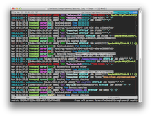

<!-- This is a comment for testing purposes -->

[](https://github.com/tstack/lnav/actions?query=workflow%3Aci-build)
[](https://docs.lnav.org)
[](https://coveralls.io/github/tstack/lnav?branch=master)
[](https://snapcraft.io/lnav)

[](https://discord.gg/erBPnKwz7R)

_This is the source repository for **lnav**, visit [https://lnav.org](https://lnav.org) for a high level overview._

# LNAV -- The Logfile Navigator

The Log File Navigator, **lnav** for short, is an advanced log file viewer
for the small-scale.  It is a terminal application that can understand
your log files and make it easy for you to find problems with little to
no setup.

## Screenshot

The following screenshot shows a syslog file. Log lines are displayed with
highlights. Errors are red and warnings are yellow.

[](docs/assets/images/lnav-syslog.png)

## Features

- Log messages from different files are collated together into a single view
- Automatic detection of log format
- Automatic decompression of GZip and BZip2 files
- Filter log messages based on regular expressions
- Use SQL to analyze your logs
- And more...

## Installation

[Download a statically-linked binary for Linux/MacOS from the release page](https://github.com/tstack/lnav/releases/latest#release-artifacts)

## Usage

The only file installed is the executable, `lnav`.  You can execute it
with no arguments to view the default set of files:

```
$ lnav
```

You can view all the syslog messages by running:

```
$ lnav /var/log/messages*
```

### Usage with `systemd-journald`

On systems running `systemd-journald`, you can use `lnav` as the pager:

```
$ journalctl | lnav
```

or in follow mode:

```
$ journalctl -f | lnav
```

Since `journalctl`'s default output format omits the year, if you are
viewing logs which span multiple years you will need to change the
output format to include the year, otherwise `lnav` gets confused:

```
$ journalctl -o short-iso | lnav
```

It is also possible to use `journalctl`'s json output format and `lnav`
will make use of additional fields such as PRIORITY and \_SYSTEMD_UNIT:

```
$ journalctl -o json | lnav
```

In case some MESSAGE fields contain special characters such as
ANSI color codes which are considered as unprintable by journalctl,
specifying `journalctl`'s `-a` option might be preferable in order
to output those messages still in a non-binary representation:

```
$ journalctl -a -o json | lnav
```

If using systemd v236 or newer, the output fields can be limited to
the ones actually recognized by `lnav` for increased efficiency:

```
$ journalctl -o json --output-fields=MESSAGE,PRIORITY,_PID,SYSLOG_IDENTIFIER,_SYSTEMD_UNIT | lnav
```

If your system has been running for a long time, for increased
efficiency you may want to limit the number of log lines fed into
`lnav`, e.g. via `journalctl`'s `-n` or `--since=...` options.

In case of a persistent journal, you may want to limit the number
of log lines fed into `lnav` via `journalctl`'s `-b` option.

## Support

Please file issues on this repository or use the discussions section.
The following alternatives are also available:

- [support@lnav.org](mailto:support@lnav.org)
- [Discord](https://discord.gg/erBPnKwz7R)
- [Google Groups](https://groups.google.com/g/lnav)

## Links

- [Main Site](https://lnav.org)
- [**Documentation**](https://docs.lnav.org) on Read the Docs
- [Internal Architecture](ARCHITECTURE.md)

## Contributing

- [Become a Sponsor on GitHub](https://github.com/sponsors/tstack)

### Building From Source

#### Prerequisites

The following software packages are required to build lnav:

- gcc/clang  - A C++14-compatible compiler.
- libpcre    - The Perl Compatible Regular Expression (PCRE) library.
- sqlite     - The SQLite database engine.  Version 3.9.0 or higher is required.
- ncurses    - The ncurses text UI library.
- readline   - The readline line editing library.
- zlib       - The zlib compression library.
- bz2        - The bzip2 compression library.
- libcurl    - The cURL library for downloading files from URLs.  Version 7.23.0 or higher is required.
- libarchive - The libarchive library for opening archive files, like zip/tgz.
- wireshark  - The 'tshark' program is used to interpret pcap files.

#### Build

Lnav follows the usual GNU style for configuring and installing software:

Run `./autogen.sh` if compiling from a cloned repository.

```console
$ ./configure
$ make
$ sudo make install
```

## See Also

[Angle-grinder](https://github.com/rcoh/angle-grinder) is a tool to slice and dice log files on the command-line.
If you're familiar with the SumoLogic query language, you might find this tool more comfortable to work with.
